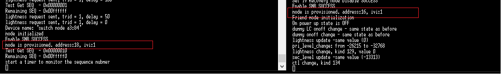

# Summary
This project demonstrates how to perform the IV update in the mesh lighting demo. The switch node will check the remaining sequence in the application periodically, and if the remaining sequence number is less than 0x400000 (adjustable), it will request an IV index update in the network. And the event "gecko_evt_mesh_node_changed_ivupdate_state_id" will be triggered to indicates that the IV index update state is ongoing. After few second, the application will exit the IV update state calling the API "gecko_cmd_mesh_test_set_ivupdate_state". After that, the IV index in the Switch node will be updated.
On the Light node side, the event "gecko_evt_mesh_node_ivrecovery_needed_id" event will be triggered when it detects the network IV index is too far in the future to be automatically updated. Enable the IV index recovery mode with the API "gecko_cmd_mesh_node_set_ivrecovery_mode".

I'd like to explain it a bit more about the IV Update procedure. The IV Update procedure can only be initiated by the node in the **primary subnet**, that why you will encounter the 0x0180 issue if provision the device to other subnet, and request an IV index update there.
As defined in the Bluetooth Mesh Profile specification, the IV Update procedure is initiated by any node that is a member of a **primary subnet**. This may be done when the node believes it is at risk of exhausting its sequence numbers, or it determines another node is close to exhausting its sequence numbers.  
Note that the key indexes are 12-bit values ranging from 0x000 to 0xFFF inclusive. A network key at index 0x000 is called the primary NetKey.  

If this node is a member of a primary subnet and receives a Secure Network beacon on a secondary subnet with an IV Index greater than the last known IV Index of the primary subnet, the Secure Network beacon shall be ignored.  

# Gecko SDK Version
v2.7  

# Hardware Required
* 2 EFR32xG21/EFR32MG12/EFR32BG13 starter kit  

# Setup
Import the included .sls files to Simplicity Studio then build and flash the project to EFR32xGxx starter kit (e.g., BRD4104A), and then provision these two device using the BluetoothMesh App in your smartphone.  

# How it Works
## Step 1
Program these two projects to BG13P starter kit respectively, and provision them with your smartphone, and make sure that the Switch can control the Light correctly.

## Step 2
Reset these two nodes, and you should able to find the log output similar as below to show the current IVI of the network.
```node is provisioned. address:16, ivi:0```  

<div align="center">
    
</div>  
<div align="center">
  <b>Figure 1-1 Current IV index</b>
</div>  
<br>

## Step 3
And also you can find the information below on the Switch node console output.
```
Test Get SEQ  - 0x00400000
Remaining SEQ - 0x00c00000
``` 

## Step 4
Press button 0/1 on Switch node to control the Light node, and you will get a increasing SEQ number and decreasing remaining SEQ number output.
```
Test Get SEQ  - 0x0040000e
Remaining SEQ - 0x00bffff2
```

## Step 5
Reset the Switch node, and the SEQ will be increased to 0x00800000
```
Test Get SEQ  - 0x00800000
Remaining SEQ - 0x00800000
```

## Step 6
Repeat Step 4 and Step 5, until the SEQ on the Switch side reach 0x00C00000, and now the Switch node will request an IV index update in the network. And after few second (5s in the test project), it will exit the IV update state.
And now, an event “gecko_evt_mesh_node_ivrecovery_needed_id” will be triggered on the Light node side. 

<div align="center">
    
</div>  
<div align="center">
  <b>Figure 1-2 Request IV Index Update</b>
</div>  
<br>

## Step 7
Press button 0/1 on the Switch node side to send command, and you will find that the SEQ has been reset to 0. And the Light node also can receive the command successfully.
<div align="center">
    
</div>  
<div align="center">
  <b>Figure 1-3 IV Index Updated Successfully</b>
</div>  
<br>


## Step 8
Reset these two nodes, and the IVI is 0x1 now.
<div align="center">
    
</div>  
<div align="center">
  <b>Figure 1-4 Reset and Check the Current IV Index</b>
</div>  
<br>

# .sls Project Used
iv_recovery_soc-btmesh-light.sls
iv_update_soc-btmesh-switch.sls

# How to Port to Another board
Create a new Bluetooth Mesh project for your board, and make sure it works. And then port the app.c of the example project to your projects.

# Reference
1. [KBA_BT_0513: IV Update & Recovery Procedure and Sequence Number Storing Strategy](https://www.silabs.com/community/wireless/bluetooth/knowledge-base.entry.html/2019/09/02/iv_update_recoveryprocedureandsequencenumber-t90G)  
2. ["3.10.5 IV Update procedure" of Bluetooth Mesh Specification](https://www.bluetooth.com/specifications/mesh-specifications/)  
