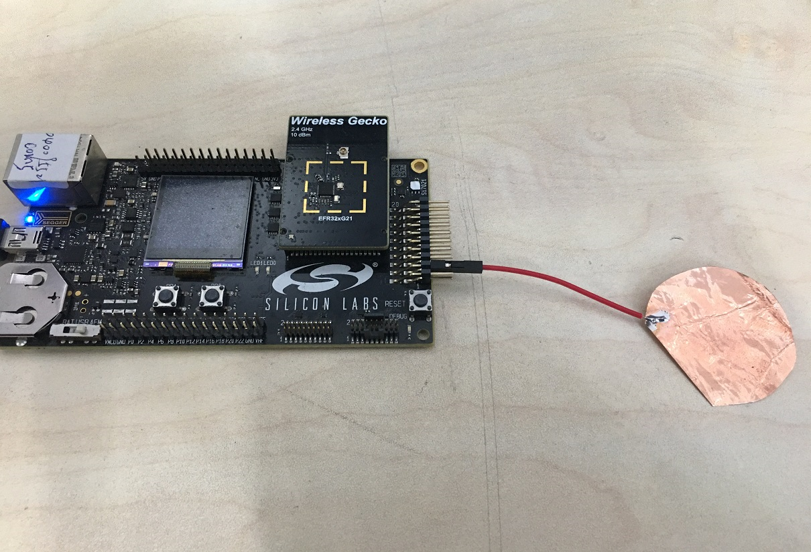
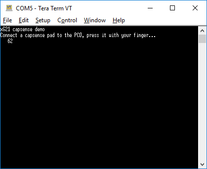
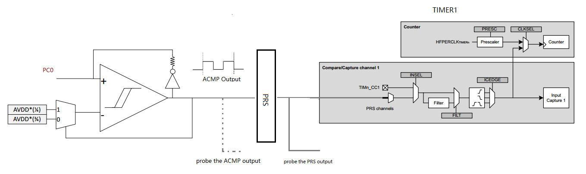
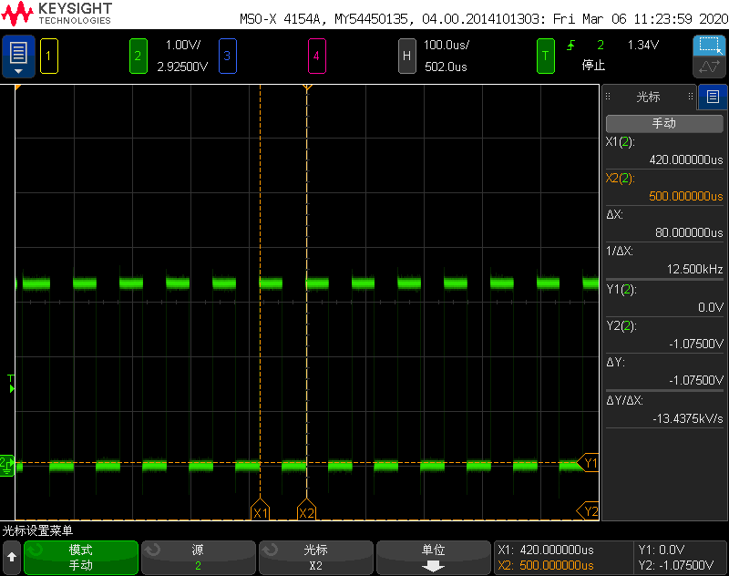

# Summary
This project demonstrates the capacitive sense functionality in EFR32xG21 starter kit using ACMP, TIMER0 and TIMER1.  

The analog comparator (ACMP) includes specialized hardware for capacitive sensing of passive push buttons. Such buttons are traces on the PCB laid out in a way that creates a parasitic capacitor between the button and the ground node. Because a human finger will have a small intrinsic capacitance to ground, the capacitance of the button will increase when the button is touched. Thus the frequency produced will decrease when the button is touched compared to when it is not touched.  
By measuring the output frequency with a timer (via the PRS), the change in capacitance can be detected.  

# Gecko SDK Version
v2.7  

# Hardware Required
* 1 EFR32xG21 starter kit  
* A external capacitive touch button  
Connect the external capacitive touch button to the EFR32xG21 starter kit PC0 (EXP_HEADER4) as illustrated below.  
<div align="center">
    
</div>  
</br>  

# Setup
Import the included .sls file to Simplicity Studio then build and flash the project to EFR32xG21 starter kit (BRD4181A), the VCOM console will print a increasing number with each touch of the capacitive button.  
<div align="center">
    
</div>  
</br>  

# How it Works
## Enable the debug output
In general, you can use the UART console, on-board LCD display for debugging information output. And in this example, we just enable the on-board VCOM port as the debugging information output port.  
```
RETARGET_SerialInit();
```

## Initializes the Capacitive Sense System.
Capacitive sensing uses two timers: TIMER0 and TIMER1 as well as ACMP. ACMP is set up in cap-sense (oscillator mode). TIMER1 counts the number of pulses generated by ACMP_CAPSENSE.  
<div align="center">
    
</div>  
</br>  

Because the frequency output of the ACMP will decrease when the button is touched compared to when it is not touched. We can use the TIMER1 to counter the output frequency, the TIMER0 is configured to overflow after a given period, when TIMER0 expires it generates an interrupt, and the number of pulses counted by TIMER1 is then stored in the TIMER0 ISR.  
The output from the comparator and the capacitive sense output are available as alternate functions to the GPIO pins directly, and we can output the PRS to the GPIO pins as well.  
Below is the output frequency if no touch, and the measured frequency is around 18.182kHz. The value might vary in different system.  
<div align="center">
    
</div>  
</br>  

If the capacitive button is touched, the frequency will decrease. And the measure frequency in the system is around 12.5kHz.  
<div align="center">
    
</div>  
</br>  

# .sls Project Used
BRD4181A_EFR32xG21_acmp_capsense.sls  

# How to Port to Another board
A header file ```capsenseconfig.h``` is included in this project to configure the capacitive functionality.  
**ACMPx module**
The macros below defines the ACMPx peripheral use in this project.  
```
#define ACMP_CAPSENSE                           ACMP0
#define ACMP_CAPSENSE_CMUCLOCK                  cmuClock_ACMP0
```

**Capsense Channels**
This project only demonstrate a signal channel (button) touch detection, however, it's straightforward for the user to change the ```CAPSENSE_CHANNELS``` to extend the capability to multi-channels.  

```
#define CAPSENSE_CHANNELS       { acmpInputPC0 }
```

**PRS Channel**
As explained before, the output frequency from ACMP will be route to a timer for counting the number of pulses in a given period. Please consider the available PRS channel well if need to output the ACMP output to a specified gpio pins for debugging purpose. Not all of the gpio pins are available for a specified PRS channel, for more information please check the EFR32xG21 datasheet, e.g., PRS.ASYNCH0 - PRS.ASYNCH5 cannot only output to PA/PB port.  
In this project, we route the PRS output to PC1, so only the PRS channel PRS.ASYNCH6 - PRS.ASYNCH11 is available.  
```
#define PRS_CH_ACMP_TO_TIMER                    6
```

# Reference
[Low power capacitive sense in EM2 for EFM32/EZR32/Wireless Gecko without LESENSE peripheral](https://www.silabs.com/community/mcu/32-bit/knowledge-base.entry.html/2016/01/14/low_power_capacitive-SbaF)  
[ACMP Peripheral Examples](https://github.com/SiliconLabs/peripheral_examples/tree/master/series2/acmp)  
[EFR32xG21 Reference Manual](https://www.silabs.com/documents/public/reference-manuals/efr32xg21-rm.pdf)  
[EFR32MG21 datasheet](https://www.silabs.com/documents/public/data-sheets/efr32mg21-datasheet.pdf)  