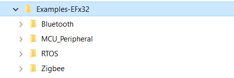

# Introduction
We use the Examples-EFx32 repo to collect some examples demonstrate how to use the EFx32 (EFR32 and EFM32). It includes Bluetooth, Zigbee, MCU use case at this moment.

## Directory structure
There are several different directories for different wireless sub projects in this repository such as Zigbee, Bluetooth, MCU respectively. 
The directory structure of the repository seems like below.

    

  

  <b></b>

  
 
