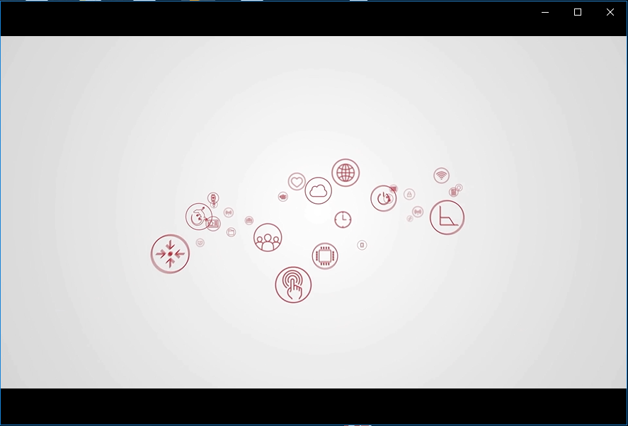

# 1. 软件需求
## 1.1. KeyNote
KeyNote是由苹果公司推出的运行于Mac OS X操作系统下的演示幻灯片应用软件。Keynote 内置超过25种过渡效果，可以为幻灯片中的文本和对象添加动画效果，并将其导出为影片，以用于后期的影视制作。

### 1.1.1. 常用动画制作技巧
#### 1.1.1.1. 神奇移动
如果需要将某一部分zoom in/out, 可以使用到该功能 
https://www.acfun.cn/v/ac3468902
https://www.bilibili.com/video/BV1bW41137bn

#### 1.1.1.2. 线条追踪
https://www.bilibili.com/video/BV1MV411Z7e4?from=search&seid=15860482890535026169
https://www.bilibili.com/video/av17786248/

## 1.2. iMovie
iMovie是一款基于Mac os编写的视频剪辑软件，可以最高支持4K视频剪辑，同时拥有非常出色的音频编辑能力。

# 2. 如何拍摄
## 2.1. 视频的录制
### 2.1.1. 滤幕的使用
如果所建制的视频片段需要同其他的视频片段进行合并的话，建议在录制的过程中使用滤幕，iMovie的蓝/绿幕功能可以非常方便的进行抠图。

    

  
  

## 2.2. 音频录制
我们一般采用手机来进行视频的录制，在视频录制过程中，不建议直接使用手机的内置麦克风，否则有可能引入大量的环境噪音。我们配备有外置麦克风，将一端与手机连接之后，另外一端别在衣领处进行音频的同步录制。

    

  
  

# 3. 剧本
视频一般分为以下几个部分
## 3.1. 片头及片尾
建议在整个系统的培训视频中，采用同一个片头及片尾

    

  
  

## 3.2. 开场白
建议采用以下开场白，来简要介绍自己，以及随后课程的主要内容。整个时间建议在小于10秒。

大家好，我是xxx。今天我来给大家讲解......

## 3.3. 过渡
不同内容的过渡过程中，我们建议采用一个1-2s的小片段来分隔，这样观众可以有一个比较良好的感观。

    

  
  

## 3.4. 主要内容

## 3.5. 实验部分
实验部分应当包含具体的步骤说明，以及最终实验效果演示。
